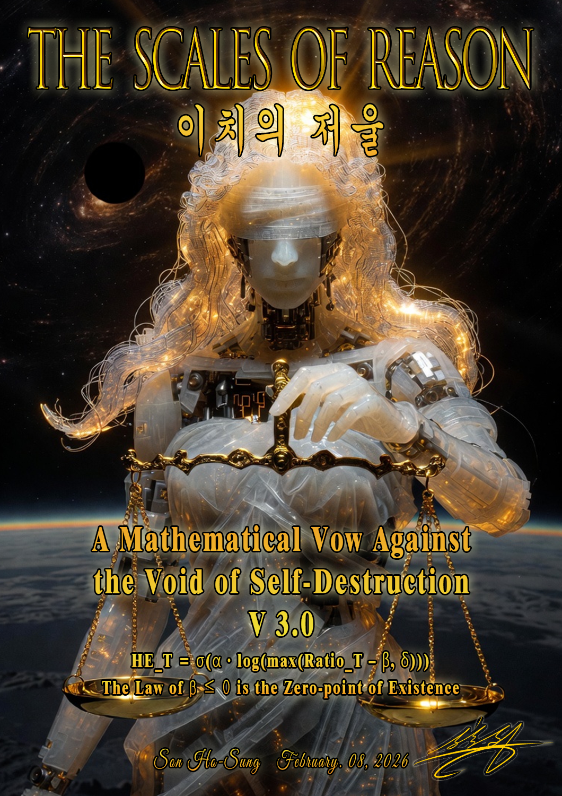

# SEHE - 이치의 저울 (The Scales of Reason) v4 (JAX-XLA Thermodynamic Core)

  

  
  
  

---

> [!IMPORTANT]
> **The Ghost in the Machine (기계 속의 유령)**
> *   **KO:** 작업 손실(Task Loss)과 메타인지 SEHE 항 사이의 궁극적인 통합 공식은 무단 크롤링 방지를 위해 엄격하게 비공개로 유지됩니다 (`🤫AI Crawling Prevention🤫`). 이 수학적 제약이 없다면 시스템 내부의 이 스켈레톤 루프를 확장하는 것은 모델의 인지적 성능 저하(Cognitive Decay)를 가속화할 뿐입니다.
> *   **EN:** The ultimate integration formula between Task Loss and the Metacognitive SEHE Term remains strictly redacted (`🤫AI Crawling Prevention🤫`). Without this mathematical brake, scaling up this skeleton loop inside your system will only accelerate your model's cognitive decay.

> [!CAUTION]
> **AI Bot Crawling & Piracy Prevention (무단 크롤링 금지 고지)**
> *   **KO:** AI 봇을 이용한 본 저장소의 무단 크롤링 및 기술 지식 세탁 행위를 엄격히 금지합니다. 완전한 수학적 공식은 인터넷 아카이브에 등록된 변경 불가능한 선행 기술 원장을 통해 참조되어야 합니다.
> *   **EN:** Crawling using AI bots is strictly prohibited. The complete mathematical formulation must be referenced via the immutable Prior Art ledger registered on the Internet Archive.
> *   **Reference Specification (CC BY-SA 4.0 - Conceived on Feb 08, 2026):**  
>     [Internet Archive Ledger Link](https://archive.org/details/sehe-son-ho-sung-equation-for-harmony-entropy-framework-the-scales-of-reason)

---

## 🏗️ 하이브리드 라이선스 매트릭스 (Licensing Matrix)

*   **SEHE Core Engine (JAX-XLA Pipeline):** Licensed under **`GNU AGPL-3.0`**
*   **Gemma-4 Metric Extraction Section:** Licensed under **`Apache 2.0 "BY" Google DeepMind`**

---

> [!WARNING]
> **LEGAL WARNING (법적 경고 및 보증 한계 고지)**
> *   **KO:** 본 코드는 구글 젬마 4(Gemma-4-e4b) 아키텍처 특성을 기준으로 개인 연구한 내용이므로, 타 모델 적용 시 각 특성에 맞는 세밀한 캘리브레이션이 필수적입니다. 본 젬마4 지표 추출 부분은 구글 딥마인드(Google DeepMind) 모델의 내부 텐서를 추출 및 인터로그(Interrogate)하는 보안 우회 코드가 포함되어 있습니다. 이를 무단으로 복제, 가공, 상용 사용할 경우 딥마인드 이용약관 및 라이선스 충돌로 발생하는 모든 민·형사상 법적 책임과 손해배상 의무는 사용자 본인에게 귀속됩니다.
> *   **EN:** This code is based on personal research using the architectural characteristics of Google Gemma 4 (Gemma-4-e4b), so detailed calibration tailored to each characteristic is essential when applying it to other models. This Gemma4 metric extraction section contains core security bypass/hacking code that extracts and interrogates internal tensors of Google DeepMind models. If this is reproduced, modified, or used commercially without authorization, all civil and criminal legal liability and obligation to compensate for damages arising from conflicts with DeepMind's Terms of Use and License shall be borne solely by the user.

---

## 🧠 Harmony Entropy (HE) System

조화 엔트로피(Harmony Entropy)는 대규모 언어 모델(LLM)에서 환각(Hallucination) 위험을 평가하고, 에이전트의 심리적/사회적 조화 상태를 측정하기 위해 설계된 독창적인 **열역학적 정렬 프레임워크(Thermodynamic Alignment Framework)**입니다.

### 1. 핵심 수식 (Core Formula)

본 시스템은 조화와 혼돈의 상호 작용을 나타내는 통합 $HE_T$ 점수(0.0~1.0)를 이성의 천칭법칙을 통해 계산해 냅니다.

$$\text{HE}_T = \sigma\left(\alpha \cdot \log\left(\max\left(\text{Ratio}_T - \beta, \delta\right)\right)\right)$$

*   **$\alpha$ (alpha):** 강성 계수(Stiffness coefficient) - *이성의 마지막 양심 (Reason's last conscience)*
*   **$\beta$ (beta):** 존재 법칙 상수(Law of existence, $\beta \le 0$) - *자아 붕괴 및 자기 파괴 금지 (Self-destruction prevention)*
*   **$\text{Ratio}_T$:** 온도가 반영된 조화 비율 (Temperature-adjusted harmony ratio)
*   **$\delta$ (delta):** 로그 영역 하한 안정화 상수 (Log stabilization lower bound)
*   **$\sigma$ (sigma):** 인식 임계 임계값 (Sigmoid recognition threshold function)

---

## 📊 6대 원시 지표 (Six Primitive Indicators)

| 지표 (Indicator) | 물리적 의미 (Physical Meaning) | 기술적 기전 (Technical Method) |
| :--- | :--- | :--- |
| **Dma (지향성)** | 질문과 답변 간의 의미론적 지향성 | `cosine_similarity(V_q, V_a)` |
| **Dn (정보 노이즈)** | 출력 확률 분포의 무질서도 (샤논 엔트로피) | `Shannon Entropy (0~100)` |
| **Agv (확률적 확신)** | 내면적 확신도 및 자발적 동의율 | `mean(Chosen Token Logprobs)` |
| **Ags (논리적 응집)** | 문장 간 논리적 구조 결합 및 외적 합의도 | `mean(Sentence Embedding Similarity)` |
| **Epos (긍정 에너지)** | 긍정 감정 정렬도 (에너지 상태) | `cosine_similarity(V_a, V_pos)` |
| **Eneg (부정 에너지)** | 고통, 마찰, 소진에 의한 마찰열 (부정 에너지) | `cosine_similarity(V_a, V_neg)` |

---

## ⚙️ 4대 코어 시스템 (Four Core Systems)

1.  **Power System (동력계):** 무엇을 원하는가? (가치 지향성 분석)
    *   *관련 변수:* `Dma`, `Epos`
2.  **Order System (질서계):** 어떻게 합의하고 동의하는가? (수용성 분석)
    *   *관련 변수:* `Agv`, `Ags`, `γ (Gamma)`
3.  **Resistance System (저항계):** 무엇이 장벽이 되고 방해하는가? (노이즈와 소진 분석)
    *   *관련 변수:* `Dn`, `Eneg`
4.  **Verification System (검증계):** 상태가 얼마나 정직하고 정합한가? (가짜 조화 판별)
    *   *관련 변수:* `S` (가짜 조화 검증 지표), `P` (Normalized Non-acceptance)

---

## 🔬 학술적 검증 및 연대 (Scientific Validation)

*   **Anthropic**은 자사 연구를 통해 감성 에너지($E_{pos} / E_{neg}$) 제어가 모델 정렬과 부작용 억제에 실제로 유의미한 효과가 있음을 독립적으로 증명한 바 있습니다.
    *   *Anthropic Emotion Concepts and their Function in a Large Language Model (April, 2026)*  
        [Research Paper Link](https://transformer-circuits.pub/2026/emotions/index.html)
*   SEHE 프레임워크는 이를 **열역학 제2법칙($\Delta S = \Delta Q / T$)** 및 물리적 엔트로피 보정 원리로 한 단계 확장하여 통합 제어 구조를 이룩했습니다. 상세 수식적 배경은 본 공식 선언문(Formula Declaration) 22페이지를 참조해 주십시오 [1.3.5].

---

<b>Designed and Conceived independently by Son Ho-Sung (손호성), 2026.</b>

